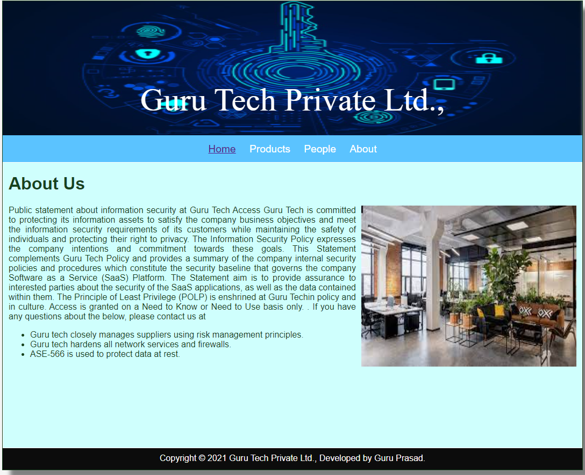
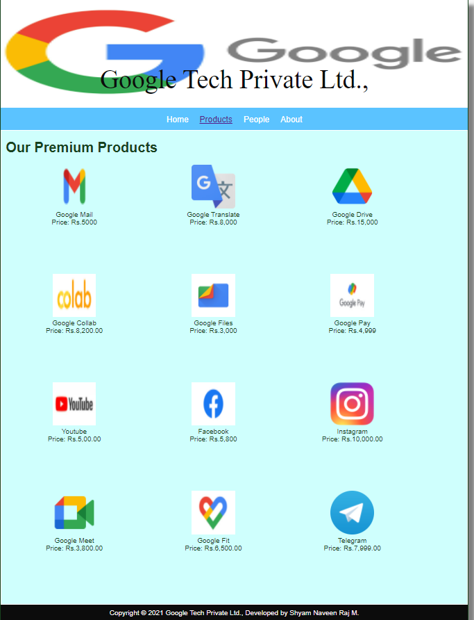
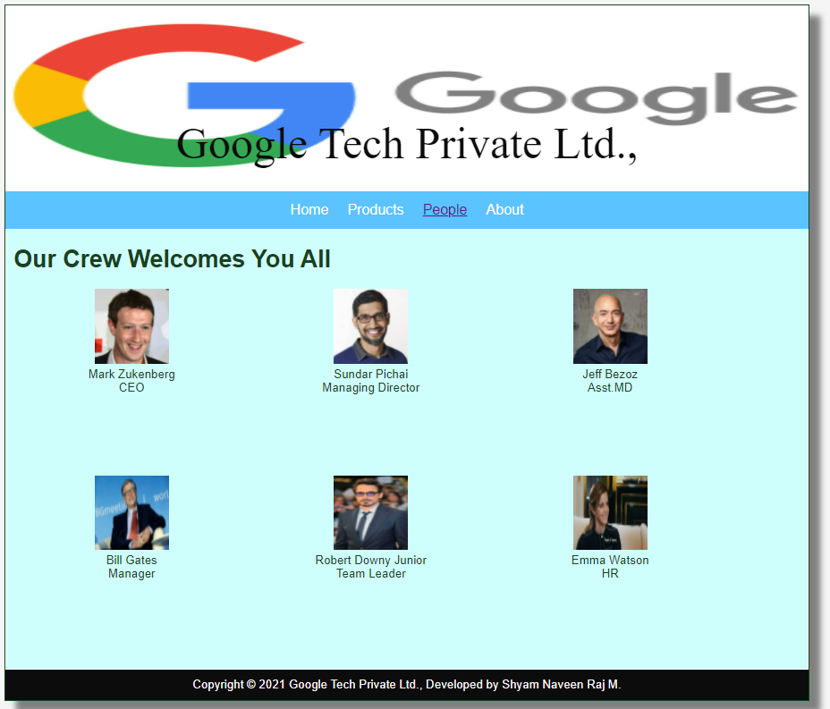
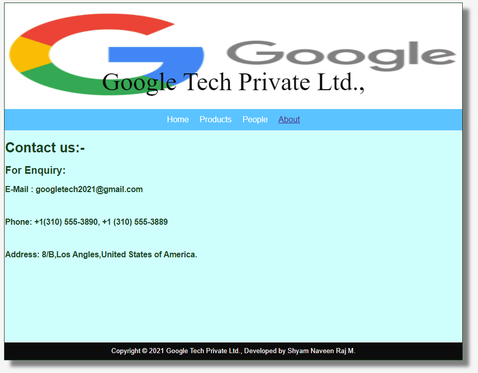

# Web Design for a Software Product Company

## AIM:

To design a static website for a software product company company.

## DESIGN STEPS:

### Step 1:

Requirement collection.

### Step 2:

Creating the layout using HTML and CSS.

### Step 3:

Updating the sample content.

### Step 4:

Choose the appropriate style and color scheme.

### Step 5:

Validate the layout in various browsers.

### Step 6:

Validate the HTML code.

### Step 6:

Publish the website in the given URL.

## PROGRAM :

### Layout.css
~~~
* {
  box-sizing: border-box;
  font-family: Arial, Helvetica, sans-serif;
}
body {
  background-color: whitesmoke;
  color: #17421d;
}
.container {
  width: 1080px;
  margin-left: auto;
  margin-right: auto;
  border-width: 1px 1px 1px 1px;
  border-style: solid;
  box-shadow: 15px 15px 8px gray;
}

.banner {
  display: block;
  width: 100%;
  height: 250px;
  text-align: center;
  font-size: 60px;
  font-family: 'Times New Roman', Times, serif;
  background-image: url("/static/img/logo.jpg");
  background-size: 100% 100%;
  margin: 0px 0px 0px 0px;
  padding-top: 150px;
  color: #ffffff;
}

.menu {
  display: block;
  width: 100%;
  height: 50px;
  font-size: larger;
  background-color: #5bc3ff;
  text-align: center;
  padding-top: 15px;
  margin: 0px 0px 0px 0px;
  border-width: 1px;
}

.menuitem {
  display: inline-block;
  margin-left: 10px;
  margin-right: 10px;
}
.menuitemselected {
  display: inline-block;
  margin-left: 10px;
  margin-right: 10px;
  color: #b0aeb4;
}

.menuitem a {
  text-decoration: none;
  color: #ffffff;
}

.content {
  display: block;
  width: 100%;
  background-color: #cffffd;
  min-height: 500px;
  margin: 0px 0px 0px 0px;
  border-width: 1px;
  border-color: white;
  border-style: solid;
}
.homecontent {
  min-height: 500px;
  margin: 10px 10px 10px 10px;
}
.homecontent h1 {
  text-align: left;
}
.homecontent img {
  float: right;
  width: 400px;
  height: 300px;
  margin-left: 10px;
}

.contenttext {
  text-align: justify;
}

.productcontent {
  min-height: 500px;
  margin: 10px 10px 10px 10px;
}

.productcontent h1 {
  text-align: left;
}

.productitems {
  display: block;
}

.productitem {
  display: inline-block;
  width: 30%;
  height: 250px;
  text-align: center;
}

.productitem img {
  width: 100px;
  height: 100px;
  display: block;
}
.productitem .itemimage {
  display: block;
  margin-left: auto;
  margin-right: auto;
  width: 100px;
  margin-bottom: 5px;
}

.productitem .itemname {
  display: block;
}
.productitem .itemprice {
  display: block;
}

.footer {
  display: block;
  width: 100%;
  height: 40px;
  background-color: #0c0c0c;
  text-align: center;
  padding-top: 10px;
  margin: 0px 0px 0px 0px;
  color: #fcf7f7;
}

~~~

### Home Page:
~~~
<!DOCTYPE html>
<html lang="en">
  <head>
    <title> Google Tech Private Ltd.,</title>
    <link rel="stylesheet" href="./css/layout.css" />
    <link rel="icon" href="./img/icon.png" type="image/x-icon" />
  </head>

  <body>
    

      
Google Tech Private Ltd.,

      

        
<a href="/static/home.html">Home</a>

        
<a href="/static/products.html">Products</a>

        
<a href="/static/people.html">People</a>

        
<a href="/static/Contact Us.html">About</a>

      

      

        

          <h1>About Us</h1>
          
          

            Google LLC is an American multinational technology company that specializes in Internet-related services and products, which include online advertising technologies, a search engine, cloud computing, software, and hardware. It is considered one of the Big Five companies in the American information technology industry, along with Amazon, Apple, Meta (Facebook) and Microsoft.[10]

Google was founded on September 4, 1998, by Larry Page and Sergey Brin while they were Ph.D. students at Stanford University in California. Together they own about 14% of its publicly-listed shares and control 56% of the stockholder voting power through super-voting stock. The company went public via an initial public offering (IPO) in 2004. In 2015, Google was reorganized as a wholly-owned subsidiary of Alphabet Inc.. Google is Alphabet's largest subsidiary and is a holding company for Alphabet's Internet properties and interests. Sundar Pichai was appointed CEO of Google on October 24, 2015, replacing Larry Page, who became the CEO of Alphabet. On December 3, 2019, Pichai also became the CEO of Alphabet.[11]
            
           In 2021, the Alphabet Workers Union was founded, mainly composed of Google employees.[12]

The company's rapid growth since incorporation has included products, acquisitions, and partnerships beyond Google's core search engine, (Google Search). It offers services designed for work and productivity (Google Docs, Google Sheets, and Google Slides), email (Gmail), scheduling and time management (Google Calendar), cloud storage (Google Drive), instant messaging and video chat (Google Duo, Google Chat, and Google Meet), language translation (Google Translate), mapping and navigation (Google Maps, Waze, Google Earth, and Street View), podcast hosting (Google Podcasts), video sharing (YouTube), blog publishing (Blogger), note-taking (Google Keep and Jamboard), and photo organizing and editing (Google Photos). The company leads the development of the Android mobile operating system, the Google Chrome web browser, and Chrome OS (a lightweight, proprietary operating system based on the free and open-source Chromium OS operating system). Google has moved increasingly into hardware; from 2010 to 2015, it partnered with major electronics manufacturers in the production of its Google Nexus devices, and it released multiple hardware products in 2016, including the Google Pixel line of smartphones, Google Home smart speaker, Google Wifi mesh wireless router. Google has also experimented with becoming an Internet carrier (Google Fiber and Google Fi).
   
Google.com is the most visited website worldwide. Several other Google-owned websites also are on the list of most popular websites, including YouTube and Blogger.[13] On the list of most valuable brands, Google is ranked second by Forbes[14] and fourth by Interbrand.[15] It has received significant criticism involving issues such as privacy concerns, tax avoidance, censorship, search neutrality, antitrust and abuse of its monopoly position.
            
          

        

      

      

        Copyright &#169; 2021 Google Tech Private Ltd., Developed by Shyam Naveen Raj M.
      

    

  </body>
</html>

~~~
### Products Page:
~~~
<!DOCTYPE html>
<html lang="en">
  <head>
    <title>Google Tech Private Ltd.,</title>
    <link rel="stylesheet" href="./css/layout.css" />
    <link rel="icon" href="./img/icon.png" type="image/x-icon" />
  </head>

  <body>
    

      
Google Tech Private Ltd.,

      

        
<a href="/static/home.html">Home</a>

        

          <a href="/static/products.html">Products</a>
        

        
<a href="/static/people.html">People</a>

        
<a href="/static/contact Us.html">About</a>

      

      

        
    
          <h1>Our Premium Products</h1>
          

              
 
                  

                  
                  

                  
Google Mail

                  
Price: Rs.5000 

              

              
 
                  

                  
                  

                  
Google Translate

                  
Price: Rs.8,000 

              

              
 
                

                
                

                
Google Drive

                
Price: Rs.15,000

              

              
 
                

                
                

                
Google Collab

                
Price: Rs.8,200.00 

              

              
 
                

                
                

                
Google Files

                
Price: Rs.3,000 

              

              

                

                
                

                
Google Pay

                
Price: Rs.4,999 

              

              
 
                

                
                

                
Youtube

                
Price: Rs.5,00.00 

              

              
 
                

                
                

                
Facebook

                
Price: Rs.5,800

              

              
 
                

                
                

                
Instagram

                
Price: Rs.10,000.00 

              

              
 
                

                
                

                
Google Meet

                
Price: Rs.3,800.00 

              

              
 
                

                
                

                
Google Fit

                
Price: Rs.6,500.00 

              

              
 
                

                
                

                
Telegram

                
Price: Rs.7,999.00 

              

          

          
        
      

      

        Copyright &#169; 2021 Google Tech Private Ltd., Developed by Shyam Naveen Raj M.
      

    

  </body>
</html>
~~~
### People page:
~~~
<!DOCTYPE html>
<html lang="en">
    <head>
        <title>Google Tech Private Ltd.,</title>
        <link rel="stylesheet" href="./css/layout.css" />
        <link rel="icon" href="./img/icon.png" type="image/x-icon" />
    </head>
    <body>
        

            
Google Tech Private Ltd.,

            

                
<a href="/static/home.html">Home</a>

                
<a href="/static/products.html">Products</a>

                
<a href='/static/people.html'>People</a>

                
<a href='/static/contact Us.html'>About</a>

            

            

                

                    <h1>Our Crew Welcomes You All</h1>
                    

                        

                            

                                
                            

                            
Mark Zukenberg

                            
CEO

                        

                        

                            

                                
                            

                            
Sundar Pichai
 
                            
Managing Director

                        

                        

                            

                                
                            

                            
Jeff Bezoz

                            
Asst.MD

                        

                        

                            

                                
                            

                            
Bill Gates

                            
Manager

                        

                        

                            

                                
                            

                            
Robert Downy Junior

                            
Team Leader

                        

                        

                            

                                
                            

                            
Emma Watson

                            
HR

                        

                    

                

            

            

                Copyright &#169; 2021 Google Tech Private Ltd., Developed by Shyam Naveen Raj M.
            

            

        

    </body>
</html>
~~~
### Contact Us page:
~~~
<!DOCTYPE html>
<html lang="en">
    <head>
        <title>Google Tech Private Ltd.,</title>
        <link rel="stylesheet" href="./css/layout.css" />
        <link rel="icon" href="./img/icon.png" type="image/x-icon" />
    </head>

    <body>
        

            
Google Tech Private Ltd.,

            

                
<a href="/static/home.html">Home</a>

                
<a href="/static/products.html">Products</a>

                
<a href='/static/people.html'>People</a>

                
<a href='/static/contact Us.html'>About</a>

            

            

                

                    <h1>Contact us:-</h1> 
                    

                        <h2>For Enquiry:</h2>
                        <h3>E-Mail : googletech2021@gmail.com</h3> 
                        <h3>Phone: +1(310) 555-3890, +1 (310) 555-3889</h3> 
                        <h3>Address: 8/B,Los Angles,United States of America.</h3> 
                    

                

            

            

            Copyright &#169; 2021 Google Tech Private Ltd., Developed by Shyam Naveen Raj M.
        

            

        

    </body>
</html>
~~~

## OUTPUT:

### Home Page:

### Products Page:

 

### People page:

### Contact Us page:

## Result:

Thus a website is designed for the software product company and the HTML,CSS code are validated.
